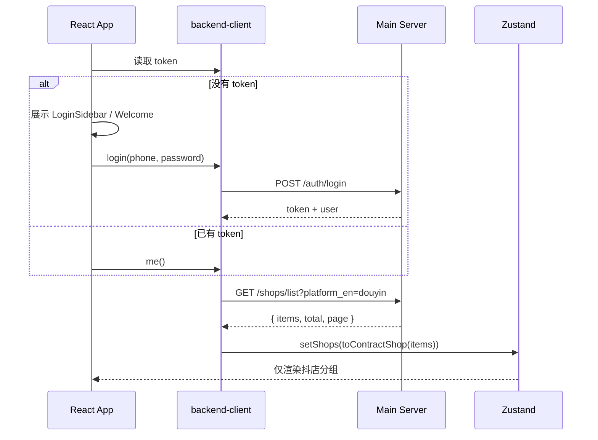
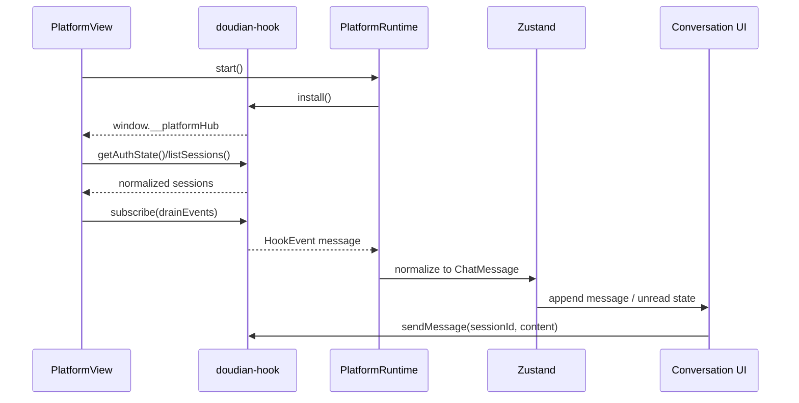

# AI Chat Client Hub 模块设计

## 总体边界

```mermaid
flowchart LR
  UI[React Desktop UI<br/>Tailwind + TanStack Router] --> Store[Zustand Workspace Store]
  Store --> Backend[backend-client<br/>Auth + Shops + Error Mapping]
  Store --> Runtime[Platform Runtime SDK]
  Runtime --> Registry[Desktop composition root<br/>PlatformRegistry + Scheduler]
  Registry --> Douyin[packages/platforms/douyin]
  Douyin --> Hook[@platform-hub/doudian-hook<br/>window runtime typed client]
  Hook --> Webview[Electron WebView / CDP Runtime.evaluate]
  Backend --> API[(f.mchaoai.com:8001/api/v1)]
  UI --> Router[TanStack Router]
```

## 登录与店铺加载流程



## 抖店消息流程



## 目录约束

```text
apps/desktop                 负责 Electron composition + React UI + platform registry
packages/contracts           跨边界数据契约与 zod schema
packages/backend-client      后端 URL、token、HTTP 错误、snake_case 适配
packages/platform-sdk        平台生命周期与统一消息协议
packages/platforms/douyin    抖店 manifest + 最新 doudian-hook adapter
packages/core                Zustand store + platform-neutral use cases
```

UI 不直接调用 `fetch`，平台包不读取 DOM，后端字段不泄漏到 React 组件。
